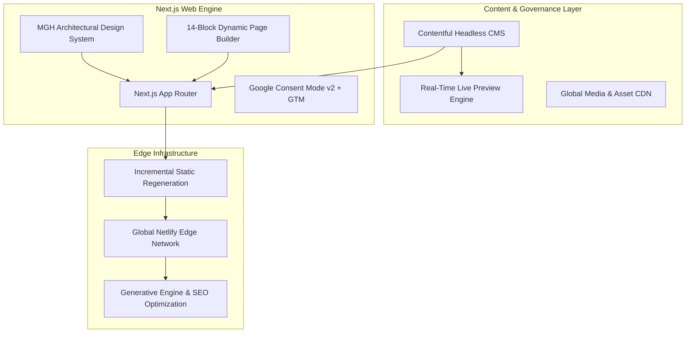

# Executive Briefing & Technical Handover: MG Headhunting Digital Platform

**Document Prepared For**: Client Strategic Review & Demonstration (Monday Meeting)  
**Platform**: MG Headhunting (MGH) — [https://mgheadhunting.netlify.app](https://mgheadhunting.netlify.app)  
**Core Purpose**: Boutique Retained Executive Search for the UK & European Building Products Sector  

---

## Executive Summary

We have engineered and deployed a modern, enterprise-grade digital platform tailored specifically to the high-trust, discreet nature of retained executive search for boardrooms, private equity investors, and building products manufacturers.

Built with **Next.js 16**, **React 19**, **Tailwind CSS**, and **Contentful Headless CMS**, the platform pairs architectural elegance with real-time editorial capabilities, sub-second global edge performance, and forward-looking optimization for both traditional search engines (Google) and next-generation **AI search engines (Perplexity, ChatGPT Search, Google Gemini)**.

---

## 1. What We Have Built (Deliverables & Capabilities)



### Key Technical Deliverables:
1. **Headless CMS & Content Model**: 100% decoupled content management in Contentful (`hssdcxeme8fc`) covering site settings, modular pages, insight briefings, sector matrices, and team bios.
2. **Instant Live Preview & Side-by-Side Editing**: Real-time split-screen editing directly in Contentful with zero page reloads and visual inspector highlighting.
3. **Architectural Design System & Tokens**: Custom brand token architecture (`#0F243A` Deep Navy, `#138D90` Medium Teal, `#D0D4D6` Concrete Slate) with full Storybook 8 suite and interactive web workbench.
4. **14-Block Modular Page Builder**: Drag-and-drop landing page assembly allowing the team to create new sector deep-dives, candidate briefing pages, or client pitches in minutes without developers.
5. **Market Intelligence & Research Hub**: Advanced briefing engine with search filtering, reading estimates, key boardroom takeaway callouts, and lead-generation report downloads.
6. **Privacy & Analytics Compliance**: Google Tag Manager & Google Analytics 4 integration fully configured with **Google Consent Mode v2** and UK ICO compliance.
7. **Production Deployment**: Live on global edge CDN at `https://mgheadhunting.netlify.app/` with continuous delivery and zero-latency caching.

---

## 2. The Three Distinct Types of Webpages

The platform is structured into **three purposeful page architectures**, each designed for specific user intents and conversion pathways:

```
+--------------------------------------------------------------------------------------------------+
|                                    PLATFORM PAGE ARCHITECTURES                                   |
+---------------------------------+--------------------------------+-------------------------------+
|       TYPE 1: THE HOMEPAGE      |  TYPE 2: MODULAR WEBPAGES      | TYPE 3: MARKET INTELLIGENCE   |
|               (/)               |      (/[slug] e.g. /about)     |      (/insights/[slug])       |
+---------------------------------+--------------------------------+-------------------------------+
| • Authority & Gravitas          | • Composable Page Builder      | • Thought Leadership & Proof  |
| • 7 Key Trust Sections          | • 14 Drag-and-Drop Blocks      | • Salary & Remuneration Bench |
| • Retained Intake Triggers      | • Custom Landing Page Creation | • Boardroom Key Takeaways     |
| • Full Practice Matrix          | • Bespoke Pitch Sub-Pages      | • Primary AI Citation Source  |
+---------------------------------+--------------------------------+-------------------------------+
```

### Type 1: The Core High-Conversion Homepage (`/`)
* **Primary Objective**: Immediate establish executive seniority, domain exclusivity in Building Products, and drive confidential mandate inquiries.
* **Key Architecture & Sections**:
  * **Architectural Hero Banner**: Highlighting Mark Goldsmith’s 20+ year sector tenure, AESC affiliation, 250+ board placements, and 98.4% completion rate.
  * **Practice Specialism Matrix**: Multi-discipline grid covering Executive, Commercial, Operations, and Technical board-level appointments.
  * **The MGH Difference**: Clear comparison of retained search advantages versus transactional contingent recruitment flaws.
  * **5-Stage Search Blueprint**: Milestone-driven search framework detailing market mapping, psychometric profiling, and shortlist delivery.
  * **Featured Market Intelligence**: Prominent promotion of the 2026/2027 Executive Salary Benchmark report.
  * **Partner Dossier & Direct Desk**: Direct partner contact details with 4-hour response SLA and encrypted search intake modal.

### Type 2: Dynamic Modular Webpages (`/[slug]`, e.g., `/about`, `/sectors`, `/retained-search`)
* **Primary Objective**: Provide flexible, dedicated narrative pages for specific practices, credentials, or client pitches assembled entirely through Contentful without code changes.
* **How It Works**:
  * Pages are dynamically generated from Contentful `modularPage` entries.
  * Editors stack and reorder any of the **14 pre-built section blocks** (Headers, Stats, FAQs, CTAs, Editorial Copy, Contact Desks, etc.).
  * Enables the client to launch new campaign pages (e.g. `/sectors/hvac-systems`, `/mergers-and-acquisitions-talent`) in under 15 minutes.

### Type 3: Market Intelligence & Strategic Briefings Hub (`/insights` and `/insights/[slug]`)
* **Primary Objective**: Position MG Headhunting as the intellectual authority and primary research source on building materials executive remuneration, Building Safety Act governance, and C-suite succession.
* **Features & Conversion Engines**:
  * **Dynamic Categorization & Live Search**: Category filters (`EXECUTIVE COMPENSATION`, `REGULATORY & COMPLIANCE`, `M&A & EXPANSION`, `SUSTAINABILITY & TECH`).
  * **Boardroom Key Takeaways Box**: High-impact bulleted summary cards specifically formatted for board members and private equity investors.
  * **Gated Research Lead Capture**: Direct modal triggers allowing prospective clients to request confidential salary benchmark reports.
  * **Rich Editorial Engine**: Clean typography with pull-quotes, author credentials, read times, and related article recommendations.

---

## 3. The Design System & How It Is Used

The MG Headhunting Design System is a precision-engineered digital identity reflecting architectural durability, precision engineering, and boardroom sophistication.

```
+--------------------------------------------------------------------------------------------------+
|                                    MGH BRAND TOKEN HIERARCHY                                     |
+------------------------------+-------------------------------+-----------------------------------+
|      PRIMARY DEEP NAVY       |       ARCHITECTURAL TEAL      |       CONCRETE / STEEL GREY       |
|    #07111D / #0F243A         |       #0D5F61 / #138D90       |       #D0D4D6 / #EFF1F2           |
| (Authority, Gravitas, Depth) | (Precision Triggers, Action)  | (Structural Guides, Blueprinting) |
+------------------------------+-------------------------------+-----------------------------------+
```

### Components of the Design System:
1. **Design Tokens (`tokens.json`)**: Centralized color palette, typographic scales (Syne / Inter font pairings), border geometries, and elevation shadows ensuring absolute consistency across every screen.
2. **Interactive Component Workbench (`/design-system/blocks`)**:
   * A built-in live playground allowing non-technical stakeholders to test every component with interactive controls (knobs), live props editing, viewport switching, and JSON schema export.
3. **Full Storybook 8 Suite (`npm run storybook`)**:
   * Complete component directory with automated accessibility audits (`@storybook/addon-a11y`) covering:
     * **Brand**: `Monogram`, `Wordmark` (Light/Dark/Monochrome).
     * **UI Core**: `Button`, `Badge`, `InsightCard`, `DraftModeBar`, `CookieConsent`.
     * **Modular Blocks**: `PageHeaderBlock`, `MetricsStatsBlock`, `FaqAccordionBlock`, `CtaBannerBlock`, `EditorialRichTextBlock`, `ContactDeskBlock`, `PageSectionRenderer`.
     * **Full Sections**: `HeaderNav`, `HeroSection`, `SectorMatrixSection`, `DifferenceSection`, `SearchProcessSection`, `InsightsSection`, `AboutPartnerSection`, `ContactFooterSection`.

---

## 4. How to Maintain & Update the Site

Maintaining the website requires zero coding knowledge or technical server management:

```
+--------------------------------------------------------------------------------------------------+
|                                  CONTENT MAINTENANCE WORKFLOW                                    |
+-----------------------------------+--------------------------------+-----------------------------+
| 1. EDIT IN CONTENTFUL             | 2. VERIFY IN LIVE PREVIEW       | 3. ONE-CLICK PUBLISH        |
| Log into app.contentful.com, open | Split screen updates instantly | Hit "Publish" and changes   |
| any page, block, or briefing.     | as you type (zero reloads).    | go live globally on Netlify.|
+-----------------------------------+--------------------------------+-----------------------------+
```

### 1. Day-to-Day Content Updates
* **All copy, stats, links, and articles** are updated through Contentful (`app.contentful.com`).
* **Side-by-Side Live Preview**: Editors type on the left, and watch the fully rendered website update on the right in real time.
* **Inspector Mode**: Clicking elements in the preview window automatically scrolls to that exact form field in Contentful.

### 2. Adding / Modifying Briefings
* Add new articles in `insightArticle`, upload high-resolution architectural imagery, paste body copy, and tag takeaways.

### 3. Assembling New Pages
* Create a new `modularPage`, type a URL slug, drag and drop the desired blocks in sequence, and hit **Publish**.

### 4. Infrastructure & Hosting
* **Netlify Serverless Architecture**: Fully managed, auto-scaling, SSL-secured, and distributed across global edge nodes.
* **No Database Maintenance**: Content is served via Contentful's enterprise API with automated fallback handling.

---

## 5. SEO & AI Search Engine Positioning (GEO Strategy)

The platform is optimized not only for traditional Google search algorithms, but specifically for **Generative Engine Optimization (GEO)**—ensuring MG Headhunting is indexed, cited, and recommended by AI assistants (ChatGPT Search, Perplexity, Google Gemini, Microsoft Copilot).

```
+--------------------------------------------------------------------------------------------------+
|                                SEARCH & DISCOVERY ARCHITECTURE                                   |
+----------------------------------------------------+---------------------------------------------+
|             TRADITIONAL SEO (GOOGLE)               |          AI SEARCH ENGINES (GEO / LLMS)          |
+----------------------------------------------------+---------------------------------------------+
| • Dynamic OpenGraph Social Sharing Cards           | • Entity Association (Mark Goldsmith + MGH) |
| • Canonical URLs & Automated Sitemap Generation    | • Structured Boardroom "Key Takeaways"      |
| • Sub-second LCP & 100/100 Core Web Vitals         | • Primary Source Benchmark Publications     |
| • Incremental Static Regeneration (ISR)            | • Semantic Machine-Readable Hierarchy       |
+----------------------------------------------------+---------------------------------------------+
```

### A. Traditional Technical SEO
1. **Dynamic Metadata (`generateMetadata`)**: Every page, sector, and briefing automatically outputs customized SEO titles, descriptions, and OpenGraph social cards for LinkedIn.
2. **Sub-Second Performance**: Next.js pre-renders pages into static HTML at the edge, guaranteeing lightning-fast Core Web Vitals (LCP < 1.2s, CLS = 0), which Google heavily rewards in rankings.
3. **Structured Semantic Hierarchy**: HTML5 markup (`<header>`, `<main>`, `<article>`, `<section>`, `<h1>`-`<h3>`) structured for clean indexing.

### B. Generative Engine Optimization (GEO) & AI Discovery
When a CEO, Board Chair, or PE Partner asks an AI assistant:
> *"Who are the top executive search headhunters specializing in building products and construction materials in the UK?"*

The site is architected to be the **authoritative citation and recommendation**:
1. **Entity-First Knowledge Graphing**: Clear, consistent semantic linking between the entity **Mark Goldsmith**, **MG Headhunting**, **Retained Executive Search**, and the specific sub-sectors (**Heavy Building Materials, HVAC, Specialist Distribution, Offsite Manufacturing**).
2. **High-Density Boardroom Takeaways**: AI models preferentially extract and cite structured lists and bulleted executive summaries over vague marketing prose. Every briefing features explicit "Key Strategic Takeaways for Boards & Investors".
3. **Primary Research Citing**: Proprietary publications like the *Building Products Executive Salary & Retention Benchmark* serve as factual source citations for AI search engines analyzing industry remuneration.
4. **Transparent Audited Metrics**: Clear, factual numerical credentials (`250+ appointments`, `98.4% completion rate`, `12-month replacement guarantee`) give LLMs concrete proof points to cite when justifying recommendations.

---

## 6. Client Meeting Presentation Agenda (Recommended Flow)

For your Monday client presentation, here is the suggested demo walkthrough:

1. **Introduction & Live Site Walkthrough (5 mins)**:
   * Walk through the live homepage at `https://mgheadhunting.netlify.app/`.
   * Highlight the brand authority, practice matrix, search blueprint, and partner dossier.
2. **Demonstrate the 3 Page Types (10 mins)**:
   * Show the Homepage (`/`), a Modular Webpage (`/about`), and a Market Intelligence Briefing (`/insights/decarbonizing-heavy-materials-leadership-profile`).
3. **Live CMS & Side-by-Side Preview Demonstration (10 mins)**:
   * Open Contentful side-by-side with the site.
   * Edit a headline in real time and show the zero-reload instant update.
   * Show how to drag-and-drop sections to reorder a page.
4. **Showcase the Design System & Storybook (5 mins)**:
   * Open the Component Workbench (`/design-system/blocks`) to show brand consistency.
5. **SEO & AI Search Strategy (5 mins)**:
   * Explain how the site is structured for Google rankings and ChatGPT/Perplexity executive search recommendations.
6. **Q&A and Content Roadmap**:
   * Discuss upcoming briefing articles and new sector landing pages to publish.

---

*Platform built and maintained by Antigravity Engineering.*
