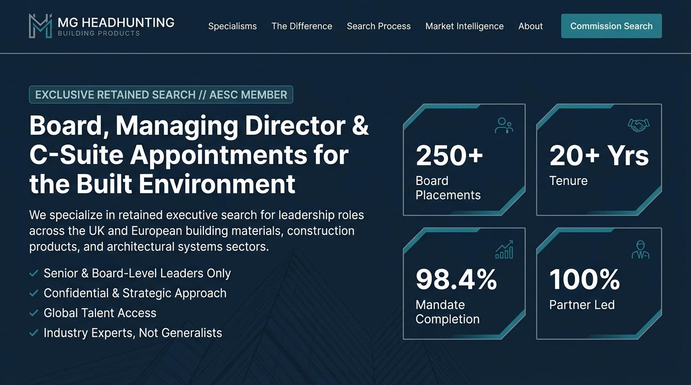
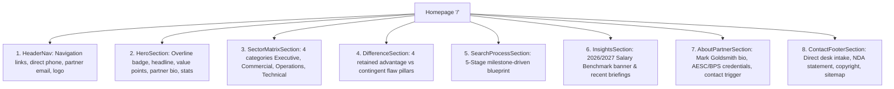
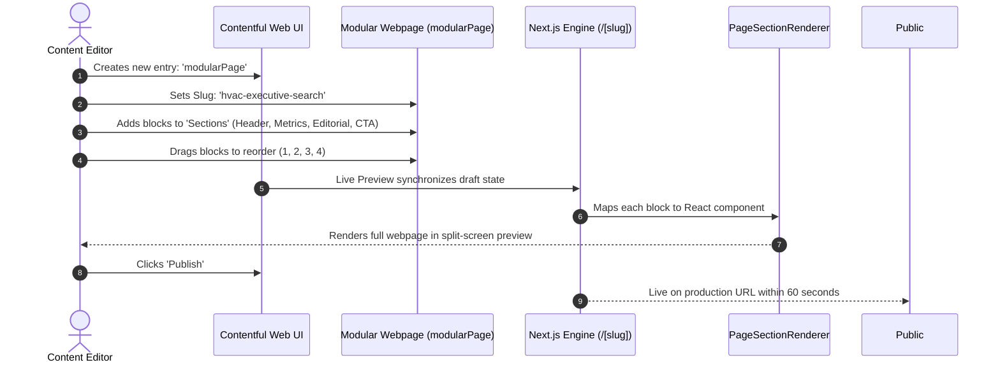
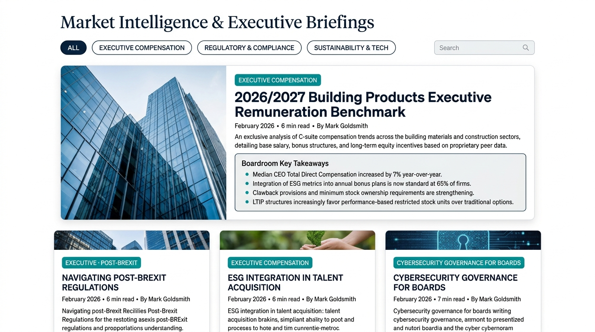
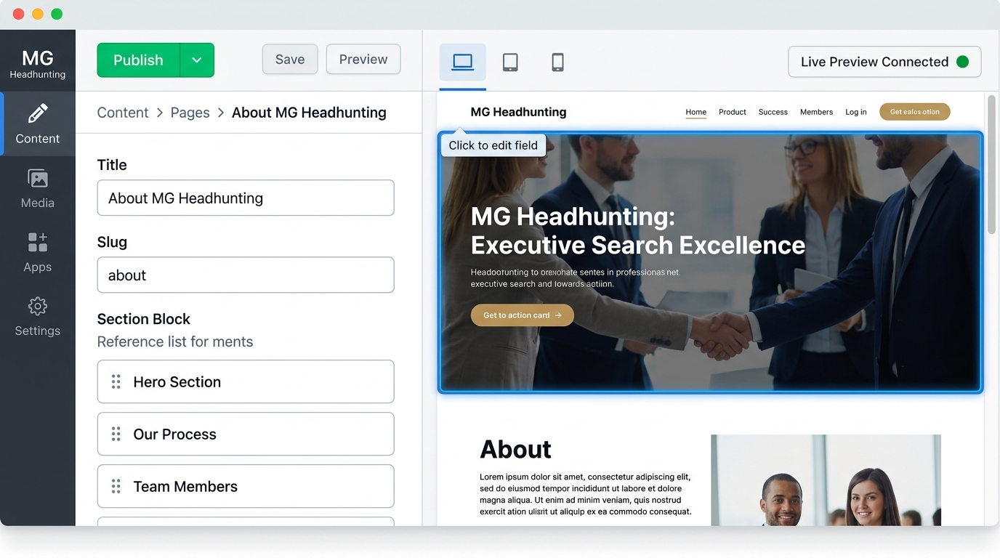
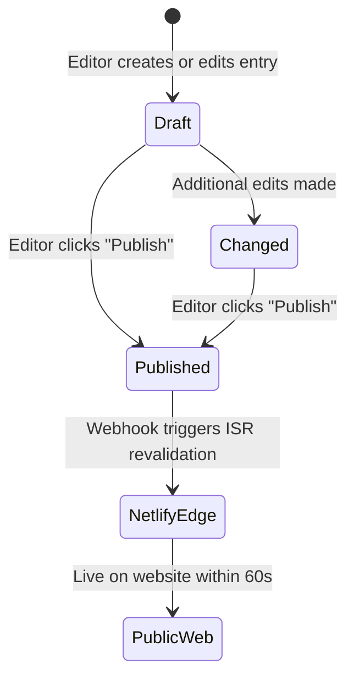

# Content Management & Architecture Guide: Where and How Content is Managed

**Platform**: MG Headhunting (MGH) — Retained Executive Search  
**Production URL**: [https://mgheadhunting.netlify.app](https://mgheadhunting.netlify.app)  
**Content Engine**: Contentful Headless CMS (Space ID: `hssdcxeme8fc`, Environment: `master`)  
**Web Framework**: Next.js 16 (App Router), React 19, TypeScript, Tailwind CSS  

---

## Executive Summary

The MG Headhunting digital platform utilizes a **100% decoupled headless architecture**. All text copy, executive biographies, practice specialisms, salary benchmarks, navigation links, and brand logos are managed independently of the codebase within **Contentful**.

The web application dynamically fetches, normalizes, and renders this content through **Incremental Static Regeneration (ISR)** for sub-second production page loads, paired with **Contentful Live Preview** for instant side-by-side editorial draft updates without code deployments.

```mermaid
graph TD
    subgraph CMS [Content Management Layer (Contentful)]
        SiteSettings[Global Site Settings & Logos]
        HomePageEntry[Homepage Entry]
        ModularPages[Modular Webpages - 13 Drag-and-Drop Blocks]
        InsightArticles[Market Intelligence Briefings]
        SharedTaxonomies[Sectors, Difference Pillars, Process Steps]
    end

    subgraph API [Data Delivery & Preview]
        CDA[Content Delivery API - Cached/CDN]
        CPA[Content Preview API - Draft Mode]
        Fallbacks[Offline / Local Fallback Layer]
    end

    subgraph Pages [Three Distinct Page Architectures]
        Type1[Type 1: Core Homepage '/']
        Type2[Type 2: Modular Webpages '/[slug]']
        Type3[Type 3: Market Intelligence '/insights' & '/insights/[slug]']
    end

    subgraph Features [Platform Capabilities]
        LivePreview[Live Preview & Split-Screen Inspector]
        LeadCapture[Retained Search Intake & Report Modals]
        GEO[GEO & AI Search Feeds: llms.txt, Schema.org]
    end

    CMS --> CDA
    CMS --> CPA
    CDA --> Pages
    CPA --> LivePreview
    Fallbacks -.->|Fallback Safety| Pages
    Pages --> Type1
    Pages --> Type2
    Pages --> Type3
    Pages --> LeadCapture
    Pages --> GEO
```

---

## Table of Contents

1. [Content Architecture Overview](#1-content-architecture-overview)
2. [The Three Distinct Types of Pages](#2-the-three-distinct-types-of-pages)
   - [Type 1: The Core High-Conversion Homepage (`/`)](#type-1-the-core-high-conversion-homepage-)
   - [Type 2: Dynamic Modular Webpages (`/[slug]`)](#type-2-dynamic-modular-webpages-slug)
   - [Type 3: Market Intelligence & Strategic Briefings Hub (`/insights`)](#type-3-market-intelligence--strategic-briefings-hub-insights)
3. [Global Content, Navigation, and Brand Assets](#3-global-content-navigation-and-brand-assets)
4. [The 13 Modular Page Builder Blocks](#4-the-13-modular-page-builder-blocks)
5. [Editorial Workflows: Step-by-Step Update Guide](#5-editorial-workflows-step-by-step-update-guide)
   - [How to Edit with Contentful Live Preview](#a-how-to-edit-with-contentful-live-preview)
   - [How to Publish and Deploy Changes](#b-how-to-publish-and-deploy-changes)
   - [How Fallback Data Protects Uptime](#c-how-fallback-data-protects-uptime)
6. [Technical & AI Search Content Management (`llms.txt`, SEO, Structured Data)](#6-technical--ai-search-content-management)
7. [Content Inventory & Field Reference Cheat Sheet](#7-content-inventory--field-reference-cheat-sheet)

---

## 1. Content Architecture Overview

Content is stored and maintained across three key layers:

| Layer | System | Purpose & Location |
| :--- | :--- | :--- |
| **Primary Headless CMS** | **Contentful** (`hssdcxeme8fc`) | Centralized repository for all user-facing copy, images, articles, navigation, and page compositions. |
| **Failover Fallback System** | **TypeScript Engine** (`src/lib/contentful/fallbacks.ts`) | Complete static mirrors of all CMS entries. If Contentful API limits are hit or the network fails, the site serves 100% styled fallback content with zero downtime. |
| **Brand Design Tokens** | **Design System** (`tokens.json` & `tailwind.config.ts`) | Global brand palette (Deep Navy `#0F243A`, Architectural Teal `#138D90`, Concrete Grey `#D0D4D6`), typography, border radiuses, and elevation shadows. |

---

## 2. The Three Distinct Types of Pages

The platform organizes all user journeys into **three distinct page types**, each tailored for specific commercial intents, conversion pathways, and content models:

```
+---------------------------------------------------------------------------------------------------+
|                                    PLATFORM PAGE ARCHITECTURES                                    |
+----------------------------------+---------------------------------+------------------------------+
|       TYPE 1: THE HOMEPAGE       |    TYPE 2: MODULAR WEBPAGES     | TYPE 3: MARKET INTELLIGENCE  |
|               (/)                |      (/[slug] e.g. /about)      |  (/insights & [slug] detail) |
+----------------------------------+---------------------------------+------------------------------+
| • Authority & Gravitas           | • Composable Page Builder       | • Thought Leadership Engine  |
| • 7 Dedicated Trust Sections     | • 13 Drag-and-Drop Blocks       | • Salary & Comp Benchmarks   |
| • Retained Intake Triggers       | • Custom Landing Pages in Mins  | • Boardroom Key Takeaways    |
| • Complete Practice Matrix       | • Bespoke Pitch Sub-Pages       | • Primary AI Citation Source |
+----------------------------------+---------------------------------+------------------------------+
```

---

### Type 1: The Core High-Conversion Homepage (`/`)

* **Route**: `/`  
* **Code Implementation**:
  * Page Loader: `src/app/page.tsx`
  * Client Component: `src/components/HomepageClient.tsx`
  * Data Resolver: `fetchHomepageData()` in `src/lib/contentful/api.ts`

#### Purpose & User Experience
The Homepage serves as the high-impact boardroom front door. It immediately conveys executive seniority, domain exclusivity in the UK and European Building Products market, Mark Goldsmith's 20+ year track record, and drives confidential executive search inquiries.

#### Visual Preview


#### Where the Content is Stored in Contentful
The homepage aggregates data from several Contentful content models:
1. **Primary Entry**: `homepage` (`content_type: 'homepage'`)
2. **Global Settings**: `siteSettings` (Navigation, logos, contact desk)
3. **Practice Matrix**: `sectorSpecialism` (Array of 6 practice disciplines)
4. **Differentiation**: `differencePillar` (4 retained vs. contingent pillars)
5. **Search Protocol**: `processStep` (5-stage search methodology)
6. **Market Intelligence**: `insightArticle` (Featured briefings and salary benchmark download)
7. **Partner Dossier**: `blockTeamProfile` (Mark Goldsmith's credentials, bio, and audit tags)
8. **Direct Desk Footer**: `blockContactDesk` (Partner email, telephone desk, NDA guarantee)

#### Content Structure & Sections Breakdown



#### How Editors Update the Homepage
1. Go to Contentful $\rightarrow$ **Content** $\rightarrow$ Filter by **Content Type**: `homepage`.
2. Open the single **Homepage** entry.
3. Update key fields:
   * **Hero Section**: `heroBadgeOverline`, `heroHeadline`, `heroHighlightedPhrase`, `heroSubtitle`, `heroKeyValues`, `heroMetricPlacements` (e.g. `250+`), `heroMetricTenure` (`20+ Yrs`), `heroMetricRetention` (`98.4%`).
   * **Practice Matrix Section**: `sectorMatrixTitle`, `sectorMatrixDescription`, `sectorMatrixSubDisciplines`.
   * **Difference Section**: `differenceTitle`, `differenceDescription`, `differenceAssuranceTitle`, `differenceReplacementGuaranteeText`.
   * **Process Section**: `processTitle`, `processDescription`.
   * **Insights Section**: `insightsTitle`, `insightsReportBannerTitle`, `insightsReportBannerDescription`, `insightsReportBannerCtaText`.
   * **Linked Blocks**: Click on `aboutPartnerBlock` or `contactFooterBlock` to update partner credentials or footer notices.
4. Preview updates in the right-hand **Live Preview** pane, then click **Publish**.

---

### Type 2: Dynamic Modular Webpages (`/[slug]`)

* **Routes**: Any URL path defined by the editor (e.g. `/about`, `/sectors`, `/retained-search`, `/difference`, `/contact`, `/sectors/hvac-systems`)
* **Code Implementation**:
  * Page Loader: `src/app/[slug]/page.tsx`
  * Client Component: `src/components/page-builder/ModularPageClient.tsx`
  * Section Dispatcher: `src/components/page-builder/PageSectionRenderer.tsx`
  * Data Resolver: `fetchModularPageBySlug(slug)` in `src/lib/contentful/api.ts`

#### Purpose & User Experience
Modular Webpages give MG Headhunting total freedom to construct bespoke landing pages, sector practice deep dives, candidate briefing packs, or confidential pitch documents **without writing a single line of code**.

#### Visual Preview (Modular Block Composition)
![Type 2: Dynamic Modular Webpages with Drag-and-Drop Blocks (/[slug])](./images/type-2-modular-page.jpg)

#### Where the Content is Stored in Contentful
* **Content Type**: `modularPage`
* Each modular page consists of metadata (Slug, Meta Title, Meta Description, Show/Hide Header, Show/Hide Footer) and an ordered reference list of section blocks (`sections`).

#### How the Drag-and-Drop Page Builder Works



#### Supported Pre-Built Pages in the Platform
The codebase includes pre-configured modular pages (with full local fallbacks):
* **`/about`**: Partner biography, 20+ year sector tenure, AESC credentials, operating ethos, and practice advisory.
* **`/sectors`**: Comprehensive building products practice matrix, sub-disciplines, and sample executive appointments.
* **`/retained-search`**: Detailed 5-stage search methodology, 20–25 day shortlist timeline, and 12-month placement warranty.
* **`/difference`**: Retained search advantages vs. contingent recruitment flaws with performance proof metrics.
* **`/contact`**: Direct partner telephone and email desk, confidential intake form, and engagement FAQs.

#### How Editors Create a New Modular Page
1. Go to Contentful $\rightarrow$ Click **Add Entry** $\rightarrow$ Select **Modular Webpage (`modularPage`)**.
2. Fill in the page identity fields:
   * **Title**: Internal name (e.g. `HVAC & Smart Building Controls Practice`).
   * **Slug**: URL identifier without leading slash (e.g. `sectors-hvac` creates `/sectors-hvac`).
   * **Meta Title**: Search engine display title (e.g. `HVAC Executive Search | MG Headhunting`).
   * **Meta Description**: 155-character summary for Google and social previews.
   * **Show Header / Show Footer**: Boolean switches to toggle navigation and footer visibility (useful for distraction-free landing pages).
3. Under **Sections**, click **Add content** $\rightarrow$ select any of the **13 pre-built modular blocks** (detailed in Section 4).
4. **Reorder**: Drag entries up or down using the three-dot grab handles ($::$).
5. Preview live in split-screen, then click **Publish**.

---

### Type 3: Market Intelligence & Strategic Briefings Hub (`/insights` & `/insights/[slug]`)

* **Routes**:
  * Listing Hub: `/insights`
  * Article Detail: `/insights/[slug]` (e.g. `/insights/c-suite-remuneration-benchmarks-building-materials`)
* **Code Implementation**:
  * Index Route: `src/app/insights/page.tsx` + `src/app/insights/InsightsClient.tsx`
  * Detail Route: `src/app/insights/[slug]/page.tsx` + `src/app/insights/[slug]/InsightDetailClient.tsx`
  * SEO Schema: `src/components/seo/JsonLd.tsx` (`ArticleSchema`)

#### Purpose & User Experience
The Market Intelligence Hub positions MG Headhunting as the intellectual and authoritative benchmark for executive compensation, Building Safety Act governance, and C-suite talent dynamics in the built environment. It acts as the primary lead generation engine and the primary citation source for **AI search engines (Perplexity, ChatGPT, Gemini)**.

#### Visual Preview


#### Where the Content is Stored in Contentful
* **Content Type**: `insightArticle`
* **Referenced Authors**: `author` (e.g. Mark Goldsmith)
* **Referenced Media Assets**: `mediaAsset` / Contentful Asset (high-resolution cover photography)

#### Content Anatomy of an Insight Article

```
+---------------------------------------------------------------------------------------------------+
| INSIGHT ARTICLE ENTRY ANATOMY                                                                     |
+---------------------------------------------------------------------------------------------------+
| 1. METADATA: Title, Slug, Category Badge, Published Date, Read Time (e.g. "6 min read")           |
| 2. HERO COVER: Architectural high-res photography via Contentful Image CDN                        |
| 3. EXECUTIVE EXCERPT: 2-3 sentence executive abstract for cards and AI crawlers                    |
| 4. BOARDROOM KEY TAKEAWAYS: 3-5 high-impact bullet points styled in a dedicated blueprint box     |
| 5. RICH TEXT BODY: Multi-heading editorial (H2, H3), blockquotes, lists, bold definitions         |
| 6. AUTHOR DOSSIER: Mark Goldsmith avatar, title, 20+ year tenure badge, direct contact link       |
| 7. CONVERSION CALLOUT: Embedded "Commission Retained Search" banner and related research links     |
+---------------------------------------------------------------------------------------------------+
```

#### How the Hub (`/insights`) Operates
* **Featured Hero**: Displays whichever article has the `isFeatured` boolean set to `true`.
* **Category Filters**: Real-time filtering by `EXECUTIVE COMPENSATION`, `REGULATORY & COMPLIANCE`, `M&A & EXPANSION`, and `SUSTAINABILITY & TECH`.
* **Live Search**: Instant client-side search across titles, excerpts, categories, author names, and key takeaway bullet points.
* **Gated Research Banner**: Download trigger for the *2026/2027 Building Products Executive Remuneration Benchmark Report*.

#### How Editors Add or Update an Insight Article
1. In Contentful, click **Add Entry** $\rightarrow$ Select **Market Intelligence Article (`insightArticle`)**.
2. Complete the required fields:
   * **Title**: Compelling boardroom headline.
   * **Slug**: URL identifier (e.g. `building-safety-act-executive-liability`).
   * **Category**: Choose or enter category (e.g. `REGULATORY & COMPLIANCE`).
   * **Published Date & Read Time**: e.g. `February 2026` • `7 min read`.
   * **Excerpt**: Concise summary used on Google snippets and listing cards.
   * **Key Takeaways**: Add 3–5 bullet points representing the essential board briefing conclusions.
   * **Body (Rich Text)**: Format your text with H2/H3 headings, pull-quotes, bulleted lists, or hyperlinked references.
   * **Cover Image**: Upload or link an architectural photograph.
   * **Author**: Link the `Mark Goldsmith` entry.
   * **Is Featured?**: Toggle to `Yes` if this article should occupy the main hero slot on `/insights`.
3. Verify formatting via **Live Preview**, then click **Publish**.

---

## 3. Global Content, Navigation, and Brand Assets

Cross-site content that appears across every page is controlled via a single Contentful entry.

### Global Site Settings (`siteSettings`)
* **Content Type**: `siteSettings`
* **Entry Name**: Global Site Settings
* **Managed Elements**:

| Field Name | Description | Where It Renders on the Website |
| :--- | :--- | :--- |
| `siteName` | Brand Title (`MG Headhunting`) | Browser title prefix, navigation, JSON-LD schema. |
| `tagline` | Sub-branding (`Building Products`) | Top navigation wordmark divider and footer descriptions. |
| `primaryEmail` | Direct desk email | Header "Direct Desk" button, footer contact card, modal fallbacks. |
| `phone` | Direct desk telephone | Top header contact bar and footer partner desk. |
| `headquarters` | Physical office location | Header metadata, contact pages, and footer credentials. |
| `linkedinUrl` | Official LinkedIn profile | Navigation and footer social links. |
| `icoRegistrationNumber` | UK ICO registration statement | Footer compliance bar (`UK GDPR Compliant • ICO Registered`). |
| `navLinks` | JSON array of `{ label, href }` | Top header desktop menu and mobile slide-out drawer. |
| `footerSpecialisms` | List of practice areas | Footer column 1 navigation links. |
| `footerSubSectors` | List of industry sectors | Footer column 2 navigation links. |
| `copyrightText` | Legal copyright string | Bottom footer copyright line. |
| `mainLogo` | Contentful media asset | Main light-canvas brand wordmark. |
| `mainLogoDark` | Contentful media asset | Inverted dark-canvas brand wordmark used in dark footers. |
| `miniLogo` | Contentful media asset | Compact monogram mark for mobile headers and favicons. |

---

## 4. The 13 Modular Page Builder Blocks

When constructing or editing **Modular Webpages (`modularPage`)**, editors stack and arrange any combination of these 13 pre-built blocks:

| # | Block Component | Contentful Model | Best Used For | Key Editable Fields |
| :---: | :--- | :--- | :--- | :--- |
| **1** | **Page Header Block** | `blockPageHeader` | Top hero banner for sub-pages | Badge, Overline, Title, Highlighted Phrase, Subtitle, Coordinate (`MGH // 01`), Breadcrumbs |
| **2** | **Executive Summary Block** | `blockExecutiveSummary` | Direct answer / GEO summary for AI engines | Overline, Title, Direct Answer text, Key Points checklist, Citation Source |
| **3** | **Editorial Rich Text** | `blockEditorialRichText` | Long-form methodology copy & partner pull-quotes | Layout (`sidebar` or `single`), Lead Paragraph, Rich Text Body, Quote Callout, Key Takeaways |
| **4** | **Metrics & Stats Block** | `blockMetricsStats` | Performance proof and track-record numbers | Title, Subtitle, Stats Array (`value`, `label`, `description`, `tag`) |
| **5** | **Sector Grid Block** | `blockSectorGrid` | Interactive 4-quadrant practice matrix | Section Label, Title, Description (automatically pulls from `sectorSpecialism`) |
| **6** | **Difference Pillars Block** | `blockDifferencePillars` | Retained search vs. contingent comparison | Section Label, Title, Description, Guarantee assurances (pulls from `differencePillar`) |
| **7** | **Process Timeline Block** | `blockProcessTimeline` | 5-Stage search blueprint timeline | Section Label, Title, Description (pulls from `processStep`) |
| **8** | **Insights Teaser Block** | `blockInsightsTeaser` | Carousel/grid of recent briefings on landing pages | Title, Category filter, Limit count, Salary Benchmark report banner toggle |
| **9** | **Team / Partner Profile** | `blockTeamProfile` | Mark Goldsmith credentials and executive bio | Partner Name, Role, Tenure, Bio paragraphs, Credentials checklist (`AESC`, `BPS Level A/B`) |
| **10** | **FAQ Accordion Block** | `blockFaqAccordion` | Collapsible Q&A addressing fees, speed, confidentiality | Section Label, Title, Description, FAQ Items Array (`category`, `question`, `answer`) |
| **11** | **CTA Banner Block** | `blockCtaBanner` | High-contrast mandate conversion triggers | Variant (`navy`, `blueprint`, `dark`), Title, Description, CTA Text, Action (`searchModal` or `link`) |
| **12** | **Contact Desk Block** | `blockContactDesk` | Direct partner contact desk with phone/email | Direct Email, Phone, Office Location, Strict NDA assurance text |
| **13** | **Hero Banner Block** | `blockHero` | Alternative full-width hero for campaign pages | Badge, Headline, Highlighted Phrase, Key Values bullets, Metrics counters |

---

## 5. Editorial Workflows: Step-by-Step Update Guide

### A. How to Edit with Contentful Live Preview

Every page and article supports **Side-by-Side Live Preview** with zero reloads and visual element inspection:

```
+-----------------------------------------+-----------------------------------------+
| CONTENTFUL EDITORIAL FORM (Left)        | LIVE PREVIEW ENVIRONMENT (Right)        |
+-----------------------------------------+-----------------------------------------+
| Entry: About MG Headhunting             | [ABOUT MG HEADHUNTING]                  |
| Title: [ About MG Headhunting       ]   | Boutique Executive Search               |
|                                         | Delivering Board & C-Suite Appointments |
| Section List:                           |                                         |
|  1. [ Page Header Block           ]     | [ 98.4% Mandate Completion ]            |
|  2. [ Metrics & Stats Block       ]     | [ 20+ Yrs Dedicated Sector Focus ]      |
|  3. [ Editorial Rich Text Block   ]     |                                         |
|                                         | [ BLUEPRINT VIEWPORT: Desktop | Mobile] |
+-----------------------------------------+-----------------------------------------+
```

#### Visual Preview: Split-Screen Live Preview & Inspector Mode


1. **Log in**: Open [app.contentful.com](https://app.contentful.com) and select the **MG Headhunting** space.
2. **Open the Entry**: Navigate to **Content** and select the page, article, or block you want to edit.
3. **Open Preview**: In the top-right corner of the editor, click the **Preview** button $\rightarrow$ **Open Live Preview** (or click the split-screen icon).
4. **Edit and Watch**:
   * As you type in any field, changes reflect on the right-hand website **in real time without saving**.
   * **Inspector Mode**: Hover over any section in the live preview window. When an element outlines in blue, click it; the left-hand form will automatically scroll to that exact field!
   * **Device Toolbar**: Use the device icons at the top of the preview pane to test formatting on Desktop, Tablet, and Mobile viewports.

---

### B. How to Publish and Deploy Changes

Content updates follow an enterprise-safe publishing lifecycle:



1. **Draft State (Yellow)**: The entry is only visible in Live Preview or to users with the preview cookie enabled.
2. **Publishing**: Click the green **Publish** button in the top right.
3. **Edge Invalidation (ISR)**: Next.js uses an Incremental Static Regeneration cache of **60 seconds** (`revalidate = 60`). Once published in Contentful:
   * The live website automatically refreshes within 60 seconds without rebuilding the application.
   * If a full static rebuild is triggered on Netlify, all pages re-bake with the latest Contentful data.

---

### C. How Fallback Data Protects Uptime

To guarantee that the website never crashes or displays blank screens during Contentful API maintenance or network failures, the platform implements a **two-tier data hydration pattern**:

```typescript
// Architectural Pattern in src/lib/contentful/api.ts
export async function fetchSiteSettings(preview = false): Promise<SiteSettingsFields> {
  try {
    const client = getContentfulClient(preview);
    const response = await client.getEntries({ content_type: 'siteSettings', limit: 1 });
    if (response.items.length > 0) {
      // Merge remote CMS fields on top of local fallbacks
      return { ...fallbackSiteSettings, ...response.items[0].fields };
    }
  } catch (err) {
    console.warn('[Contentful API] Fallback triggered:', err);
  }
  return fallbackSiteSettings;
}
```

* **Zero-Downtime Guarantee**: If Contentful returns an error or is unreachable, the site automatically renders the corresponding fallback entry from `src/lib/contentful/fallbacks.ts`.
* **Local Offline Development**: Developers can run the entire platform locally without network connectivity or API tokens.

---

## 6. Technical & AI Search Content Management

The platform is optimized for **Generative Engine Optimization (GEO)** to ensure AI models (ChatGPT Search, Perplexity, Google Gemini) accurately cite MG Headhunting for UK and European building products executive search.

### Managed AI & Search Files

| File / Route | Implementation | Content Source | Purpose |
| :--- | :--- | :--- | :--- |
| **`/llms.txt`** | `src/app/llms.txt/route.ts` | Dynamic: pull from `siteSettings`, `sectorSpecialism`, and `insightArticle` | Compact Markdown feed optimized for LLM context windows and RAG search indexing. |
| **`/llms-full.txt`** | `src/app/llms-full.txt/route.ts` | Dynamic: full text of all insight briefings, fee structures, and methodology | In-depth knowledge ingestion for frontier AI search models. |
| **`/sitemap.xml`** | `src/app/sitemap.ts` | Dynamic: queries all published `modularPage` and `insightArticle` slugs | Search engine crawler index with publication change frequencies and priorities. |
| **`/robots.txt`** | `src/app/robots.ts` | Static configuration | Explicitly allows Googlebot, Bingbot, GPTBot, PerplexityBot, and ClaudeBot. |
| **JSON-LD Schema** | `src/components/seo/JsonLd.tsx` | Dynamic: pulls organization, logo, address, and article metadata | Structured data for Google Rich Snippets and Knowledge Graph entity verification. |

---

## 7. Content Inventory & Field Reference Cheat Sheet

Use this table as an immediate operational reference when looking for where to update specific website elements:

| Content Element | Contentful Model | Entry Name or Filter | Field to Update |
| :--- | :--- | :--- | :--- |
| **Phone Number / Email Desk** | `siteSettings` | Global Site Settings | `phone`, `primaryEmail` |
| **Header Navigation Menu** | `siteSettings` | Global Site Settings | `navLinks` (JSON label & href) |
| **Website Logos (Light / Dark)** | `siteSettings` | Global Site Settings | `mainLogo`, `mainLogoDark`, `miniLogo` |
| **Homepage Hero Headline & Stats** | `homepage` | Homepage | `heroHeadline`, `heroMetric...` |
| **Sector Specialism Cards** | `sectorSpecialism` | 6 Individual entries | `title`, `description`, `sampleRoles` |
| **Retained vs. Contingent Pillars**| `differencePillar` | 4 Individual entries | `retainedAdvantage`, `contingentFlaw` |
| **5-Stage Search Process Steps** | `processStep` | 5 Individual entries | `stepNumber`, `phaseName`, `deliverable` |
| **Salary Benchmark Download Banner**| `homepage` / `blockInsightsTeaser`| Homepage / Modular Block | `insightsReportBanner...` fields |
| **About Page Content** | `modularPage` | `about` | `sections` $\rightarrow$ Edit child blocks |
| **Sector Matrix Page Content** | `modularPage` | `sectors` | `sections` $\rightarrow$ Edit child blocks |
| **Retained Search Blueprint Page** | `modularPage` | `retained-search` | `sections` $\rightarrow$ Edit child blocks |
| **Create a Brand New Webpage** | `modularPage` | Click **Add Entry** | Add `slug`, `title`, and add `sections` |
| **Publish a Market Briefing** | `insightArticle` | Click **Add Entry** | `title`, `slug`, `excerpt`, `takeaways`, `body` |
| **Feature an Article on Insights** | `insightArticle` | Selected article | Toggle `isFeatured` to `Yes` |
| **Mark Goldsmith Bio & Audit Tags** | `blockTeamProfile` / `author` | Partner Profile | `partnerBio`, `credentialsChecklist` |
| **ICO / GDPR Legal Statement** | `siteSettings` | Global Site Settings | `icoRegistrationNumber`, `copyrightText` |

---

*Document maintained for the MG Headhunting digital engineering and editorial team.*
