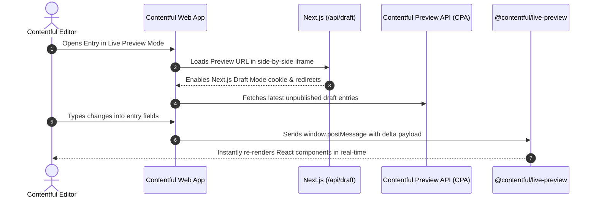

# Contentful Live Preview & Side-by-Side Editing Setup Guide

This guide details how to configure Contentful Live Preview with Next.js App Router for **MG Headhunting**, enabling real-time side-by-side editing in the Contentful Entry Editor without requiring manual page reloads or deployments.

---

## Architecture Overview



---

## 1. Environment Configuration

Ensure the following environment variables are present in your `.env.local` (for local development) and in your production deployment (Netlify/Vercel/Cloudflare):

```bash
# Contentful Space & Access Tokens
NEXT_PUBLIC_CONTENTFUL_SPACE_ID=hssdcxeme8fc
NEXT_PUBLIC_CONTENTFUL_ACCESS_TOKEN=dNLw9i3MlYkVWfwwfRZsAUQ4Rgxfyhk03P17acDxW_k
NEXT_PUBLIC_CONTENTFUL_PREVIEW_TOKEN=HLX-xI3sY5STYGnKlUN2vWr0oOaHjxVAz-jHC_zTuoI
NEXT_PUBLIC_CONTENTFUL_ENVIRONMENT=master

# Live Preview Secret (used to secure /api/draft endpoint)
CONTENTFUL_PREVIEW_SECRET=mgh_preview_secret_2026
NEXT_PUBLIC_CONTENTFUL_PREVIEW_SECRET=mgh_preview_secret_2026
```

---

## 2. Contentful Space Configuration (Step-by-Step)

Follow these steps in your Contentful web app to connect Live Preview:

### Step 1: Open Content Preview Settings
1. Log in to [app.contentful.com](https://app.contentful.com).
2. Select your space (**MG Headhunting** / `hssdcxeme8fc`).
3. Click on **Settings** (top navigation bar) $\rightarrow$ **Content preview**.

---

### Step 2: Add Preview Environment
1. Click **Add preview environment**.
2. **Name**: `MGH Live Preview (Production)` or `MGH Live Preview (Localhost)`.
3. Check the content types you want to preview:
   - `modularPage` (Modular Webpage)
   - `insightArticle` (Market Intelligence Briefing)
   - `siteSettings` (Site Settings & Navigation)

---

### Step 3: Configure URL Templates per Content Type

Configure the preview URLs for each content type using the following formulas:

#### A. Modular Pages (`modularPage`)
* **URL template**:
  ```text
  https://your-domain.com/api/draft?secret=mgh_preview_secret_2026&slug={entry.fields.slug}
  ```
  *(For local dev: `http://localhost:3000/api/draft?secret=mgh_preview_secret_2026&slug={entry.fields.slug}`)*

#### B. Insight Articles (`insightArticle`)
* **URL template**:
  ```text
  https://your-domain.com/api/draft?secret=mgh_preview_secret_2026&type=insight&slug={entry.fields.slug}
  ```
  *(For local dev: `http://localhost:3000/api/draft?secret=mgh_preview_secret_2026&type=insight&slug={entry.fields.slug}`)*

#### C. Site Settings / Homepage (`siteSettings`)
* **URL template**:
  ```text
  https://your-domain.com/api/draft?secret=mgh_preview_secret_2026&slug=
  ```
  *(For local dev: `http://localhost:3000/api/draft?secret=mgh_preview_secret_2026&slug=`)*

---

## 3. How to Use Side-by-Side Live Preview

1. Go to the **Content** tab in Contentful.
2. Open any **Modular Page** or **Insight Article**.
3. In the upper right corner of the entry editor, click **Preview** $\rightarrow$ **Open Live Preview**.
4. A split-screen window will open with the Contentful form editor on the left and your Next.js preview website on the right.
5. **Real-time typing**: Edit any headline, copy, badge, or stat—the preview panel will update immediately as you type without saving or publishing!
6. **Inspector Mode**: Hover and click elements on the preview screen to jump directly to that field in the Contentful editor.

---

## 4. Preview Endpoints Reference

| Endpoint | Method | Description |
| :--- | :--- | :--- |
| `/api/draft?secret=...&slug=...` | `GET` | Enables Next.js Draft Mode cookies, requests draft content from `preview.contentful.com`, and redirects to the preview page. |
| `/api/disable-draft?redirect=...` | `GET` | Disables Draft Mode cookies and returns to standard CDN published delivery mode. |

---

## 5. Security & ISR Behavior

* When Draft Mode is active, Next.js ISR cache is automatically bypassed for that session.
* Public visitors without the draft cookie continue to receive ultra-fast cached static pages from CDN.
* The floating `DraftModeBar` component provides immediate visual confirmation of active preview mode and a 1-click button to exit.
