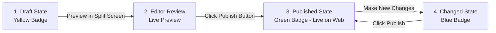

# Content Editor's Guide: Editing Content with Contentful & Live Preview

Welcome to the **MG Headhunting (MGH)** Content Management Guide. This document explains how editors, copywriters, and administrators can create, edit, reorder, and publish content across the entire website while viewing real-time, side-by-side visual updates via **Contentful Live Preview**.

---

## Table of Contents
1. [Logging In & Navigating Contentful](#1-logging-in--navigating-contentful)
2. [How Live Preview Works (Side-by-Side Split Screen)](#2-how-live-preview-works-side-by-side-split-screen)
3. [Editing Existing Pages & Content](#3-editing-existing-pages--content)
   - [Editing the Homepage & Site Settings](#a-editing-the-homepage--global-site-settings)
   - [Editing Modular Webpages (About, Sectors, Retained Search)](#b-editing-modular-webpages-about-sectors-retained-search)
   - [Editing Market Intelligence Briefings (Insights Articles)](#c-editing-market-intelligence-briefings-insights)
4. [Creating New Modular Pages (Drag-and-Drop Page Builder)](#4-creating-new-modular-pages-drag-and-drop-page-builder)
5. [Publishing Workflow & Draft vs. Published Status](#5-publishing-workflow--draft-vs-published-status)
6. [Best Practices & Tips for High-Impact Content](#6-best-practices--tips-for-high-impact-content)
7. [Troubleshooting & FAQs](#7-troubleshooting--faqs)

---

## 1. Logging In & Navigating Contentful

1. Open your browser and navigate to **[app.contentful.com](https://app.contentful.com)**.
2. Sign in with your Contentful credentials.
3. In the top-left space switcher, ensure you are in the **MG Headhunting** space (Space ID: `hssdcxeme8fc`).
4. Click the **Content** tab in the main top navigation.
5. In the **Content Type** filter dropdown on the left, you can quickly filter by what you wish to edit:
   * **Modular Webpage (`modularPage`)**: Landing and content pages (e.g., `/about`, `/sectors`, `/retained-search`).
   * **Market Intelligence Article (`insightArticle`)**: Thought leadership, salary benchmarks, regulatory briefings.
   * **Site Settings & Navigation (`siteSettings`)**: Global navigation, partner direct email, footer metadata.
   * **Block Components (`block...`)**: Individual sections like headers, stats, FAQs, CTAs, or rich text.

---

## 2. How Live Preview Works (Side-by-Side Split Screen)

Whenever you open any **Modular Page** or **Market Intelligence Article**, you can activate the Live Preview split-screen:

### How to Open Live Preview
1. Click on the entry you want to edit.
2. In the top-right corner of the entry editor screen, click the **Preview** button $\rightarrow$ select **Open Live Preview** (or click the split-screen icon).
3. The screen will divide into two panels:
   * **Left Panel**: The Contentful form editor where you type and change fields.
   * **Right Panel**: The live, fully-rendered MG Headhunting website.

```
+------------------------------------+------------------------------------+
|         CONTENTFUL FORM            |          LIVE PREVIEW              |
|                                    |                                    |
|  Title: [ About MG Headhunting  ]  |   ABOUT MG HEADHUNTING             |
|                                    |   ====================             |
|  Lead:  [ Boutique executive... ]  |   Boutique executive search        |
|                                    |   delivering Board and C-Suite...  |
|  Sections (Drag & Drop):           |                                    |
|   1. [ Page Header Block     ]     |   [ VERIFIED PERFORMANCE ]         |
|   2. [ Metrics & Stats Block ]     |    98.4% Mandate Completion        |
|   3. [ Editorial Rich Text   ]     |                                    |
+------------------------------------+------------------------------------+
```

### Key Live Preview Features:
* **Zero-Reload Instant Updates**: As you type in a headline, update a statistic, or add a takeaway bullet, the preview updates in milliseconds without saving or publishing.
* **Inspector Mode (Click to Edit)**: Hovering over elements in the live preview highlights them with a blue outline. Clicking on a section or title automatically scrolls the left editor form directly to that exact field.
* **Responsive Viewport Switcher**: In the preview toolbar at the top, switch between **Desktop**, **Tablet**, and **Mobile** viewports to verify that layouts and typography look balanced across all screen sizes.

---

## 3. Editing Existing Pages & Content

### A. Editing the Homepage & Global Site Settings
* **Content Type**: `siteSettings` $\rightarrow$ Open **Global Site Settings**.
* **What you can change**:
  * **Primary Email & Phone**: Updates the direct partner contact desk throughout the navigation and footers.
  * **Navigation Links**: Add, rename, or reorder header navigation menu items.
  * **Tagline & Footer Compliance**: Edit the ICO registration statement, headquarters location, and copyright notice.

### B. Editing Modular Webpages (`/about`, `/sectors`, `/retained-search`)
* **Content Type**: `modularPage` $\rightarrow$ Select the page you want to edit.
* **Fields**:
  * **Title**: Internal label and browser fallback title.
  * **Slug**: The URL path (e.g. `about` creates `https://mgheadhunting.netlify.app/about`).
  * **Meta Title & Meta Description**: SEO titles and Google search snippet summaries.
  * **Sections (List of References)**: The ordered stack of block components that make up the page.

#### Editing an Existing Block on a Page:
1. Under **Sections**, click on any linked block (e.g. `About Page - Metrics & Proof`).
2. Update the text, numeric figures, or audit tags.
3. Click the back arrow ($\leftarrow$) in the top breadcrumb to return to the parent page.

### C. Editing Market Intelligence Briefings (Insights)
* **Content Type**: `insightArticle` $\rightarrow$ Select any briefing article.
* **Key Fields to Edit**:
  * **Title**: Bold executive headline.
  * **Slug**: URL identifier (e.g. `c-suite-remuneration-benchmarks-building-materials`).
  * **Category**: Display badge (e.g., `EXECUTIVE COMPENSATION`, `REGULATORY & COMPLIANCE`, `SUSTAINABILITY & TECH`).
  * **Published Date & Read Time**: e.g., `February 2026` • `6 min read`.
  * **Excerpt**: 2–3 sentence executive summary displayed in cards and lead callout boxes.
  * **Key Takeaways**: 3–5 strategic bullet points highlighted in a bordered boardroom box.
  * **Body (Rich Text)**: Full article body with support for Headings (H2, H3), blockquotes, lists, and embedded assets.
  * **Cover Image**: Upload or select high-resolution architectural imagery.
  * **Featured Article**: Toggle to `Yes` to display the briefing in the high-impact hero slot at the top of `/insights`.

---

## 4. Creating New Modular Pages (Drag-and-Drop Page Builder)

You can assemble custom landing pages, practice area deep-dives, or campaign pages in minutes using pre-built modular blocks:

### Step 1: Create the Page Entry
1. In Contentful, click **Add entry** $\rightarrow$ select **Modular Webpage (`modularPage`)**.
2. Set **Title** (e.g., `HVAC & Climate Systems Executive Practice`).
3. Set **Slug** (e.g., `sectors/hvac-systems` or `hvac-executive-search`).
4. Add **Meta Title** and **Meta Description** for search engines.

### Step 2: Add Modular Section Blocks
Under **Sections**, click **Add content** $\rightarrow$ choose from the 14 available block types:

| Block Component | Best Used For |
| :--- | :--- |
| **Page Header Block (`blockPageHeader`)** | Top hero banner with technical coordinate, breadcrumbs, badge, and bold headline. |
| **Metrics & Stats Block (`blockMetricsStats`)** | 3 or 4 column performance cards (`98.4% Completion`, `4.8 Wks Shortlist`). |
| **Editorial Rich Text (`blockEditorialRichText`)** | Long-form methodology copy, pull-quotes from Mark Goldsmith, and key factor checklists. |
| **FAQ Accordion Block (`blockFaqAccordion`)** | Collapsible Q&A addressing confidentiality, fee structures, and timelines. |
| **CTA Banner Block (`blockCtaBanner`)** | High-contrast conversion trigger (Navy, Blueprint Teal, or Light). |
| **Contact Desk Block (`blockContactDesk`)** | Direct phone/email partner desk with confidential intake modal trigger. |
| **Sector Grid Block (`blockSectorGrid`)** | Interactive practice matrix displaying executive, commercial, and technical sub-disciplines. |
| **Difference Pillars Block (`blockDifferencePillars`)** | Retained advantage vs. contingent flaws comparison cards. |
| **Process Timeline Block (`blockProcessTimeline`)** | 5-Stage milestone-driven search blueprint. |
| **Team / Partner Profile (`blockTeamProfile`)** | Detailed partner credentials and bio card for Mark Goldsmith. |
| **Insights Teaser (`blockInsightsTeaser`)** | Dynamic market intelligence briefings grid and salary benchmark download banner. |

### Step 3: Reorder Sections with Drag-and-Drop
* Click and hold the three-dot grab handle ($::$) to the left of any section in the list.
* Drag it up or down to reposition the section on the page.
* The Live Preview pane updates the page layout instantly!

---

## 5. Publishing Workflow & Draft vs. Published Status

Contentful uses an entry state lifecycle that safeguards your live production site:



1. **Draft State (Yellow Badge)**:
   * Only visible to editors inside Contentful Live Preview and at `/api/draft` preview sessions.
   * Public visitors on `https://mgheadhunting.netlify.app/` do not see draft changes.
2. **Publishing to Production (Green Badge)**:
   * When you are satisfied with the preview, click the green **Publish** button in the top right.
   * The live website updates immediately across global CDNs.
3. **Draft Mode Banner on Live Site**:
   * If you visit the website with a preview session active, a discreet floating bar (`Contentful Live Preview • Draft Mode Active`) appears at the bottom.
   * Click **Exit Preview** at any time to return to public CDN delivery.

---

## 6. Best Practices & Tips for High-Impact Content

* **Tone of Voice**: Keep copy authoritative, partner-led, rigorous, and direct. Avoid generic recruitment clichés (e.g. "passionate recruiters", "rockstars"). Use boardroom and private equity terminology (e.g. "retained search", "mandate completion", "governance", "recalibration").
* **Headlines & Overlines**: Use short, uppercase overlines (`RETAINED EXECUTIVE SEARCH`, `SECTOR MATRIX`) to anchor page hierarchy.
* **Numeric Proof Points**: Pair high-level claims with verified figures (e.g., `250+ Appointments`, `12-Month Placement Warranty`).
* **Cover Images**: Use architectural, industrial, structural concrete, or modern glass facade photography from high-resolution sources.

---

## 7. Troubleshooting & FAQs

### Q: Why isn't my Live Preview updating as I type?
1. Check that the preview environment is set to `MGH Netlify Live Preview` (or `Localhost Live Preview` if working locally).
2. Ensure you have not disabled third-party cookies or blocked iframes in your browser.
3. Refresh the preview panel by clicking the refresh icon at the top of the preview frame.

### Q: How do I remove a section from a page?
Under the **Sections** field in the page entry, click the three dots ($\cdots$) next to the block you want to remove $\rightarrow$ select **Remove**. (This removes it from the page without deleting the component entry from the CMS).

### Q: Can I share a draft with a colleague before publishing?
Yes! Send them the secure preview link:
```text
https://mgheadhunting.netlify.app/api/draft?secret=mgh_preview_secret_2026&slug=YOUR_PAGE_SLUG
```
When they click the link, their browser will open the page in Draft Mode with unpublished changes visible.
